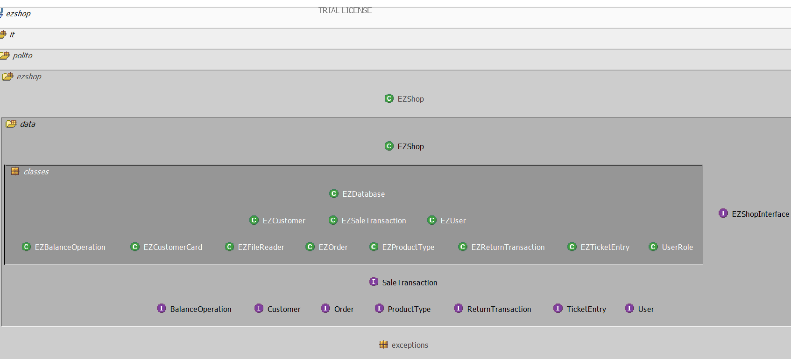
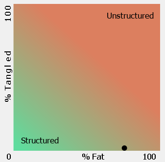

# Design assessment


```
<The goal of this document is to analyse the structure of your project, compare it with the design delivered
on April 30, discuss whether the design could be improved>
```

# Levelized structure map
```
<Applying Structure 101 to your project, version to be delivered on june 4, produce the Levelized structure map,
with all elements explosed, all dependencies, NO tangles; and report it here as a picture>
```



# Structural over complexity chart

```
<Applying Structure 101 to your project, version to be delivered on june 4, produce the structural over complexity chart; and report it here as a picture>
```



# Size metrics

```
<Report here the metrics about the size of your project, collected using Structure 101>
```

| Metric                                    | Measure |
| ----------------------------------------- | ------- |
| Packages                                  | 6       |
| Classes (outer)                           | 42      |
| Classes (all)                             | 42      |
| NI (number of bytecode instructions)      | 8212    |
| LOC (non comment non blank lines of code) | 3531    |

# Items with XS

```
<Report here information about code tangles and fat packages>
```

| Item                                                         | Tangled | Fat  | Size | XS   |
| ------------------------------------------------------------ | ------- | ---- | ---- | ---- |
| ezshop.it.polito.ezshop.data.EZShop                          | 0%      | 204  | 4812 | 1981 |
| ezshop.it.polito.ezshop.data                                 | 23%     | 2    | 8006 | 1863 |
| ezshop.it.polito.ezshop.data.classes.EZDatabase              | 0%      | 136  | 1853 | 218  |
| ezshop.it.polito.ezshop.data.EZShop.modifyCustomer(java.lang.Integer, java.lang.String, java.lang.String):boolean | 0%      | 17   | 171  | 20   |

# Package level tangles

```
<Report screen captures of the package-level tangles by opening the items in the "composition perspective" 
(double click on the tangle from the Views->Complexity page)>
```


# Summary analysis

```
<Discuss here main differences of the current structure of your project vs the design delivered on April 30>
<Discuss if the current structure shows weaknesses that should be fixed>
```

The main difference between the current design and the one delivered on April 30th is the relationship between the class BalanceOperation and the classes Order, SaleTransaction and ReturnTransaction. While in the old version we chose to have a relationship implemented through the inheritance of the three classes from BalanceOperation, now the three classes are separated and do not inherit from BalanceOperation. We chose to change the design in this way to comply with the provided APIs.

To simplicity we also decided to remove the class Position and implement the position directly in the class ProductType through a String. 

After the analysis about the complexity of the design chosen, we realized the the weakness of our structure is that the classes EZShop and EZDatabase present to much fat percentage. EZDatabase is a class that is fat because it manages all the methods of all the tables of the database. To decrease the fatness we could therefore create one class for each database table and implement the different methods in their respective class. 

As for EZDatabase, also EZShop could be improved adding more intermediate classes to whom EZShop delegates to implement all the APIs methods. For example there could be a class Inventory that manages all the methods about the transactions. 