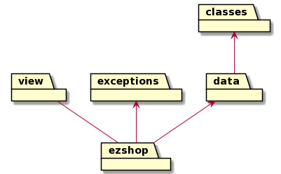
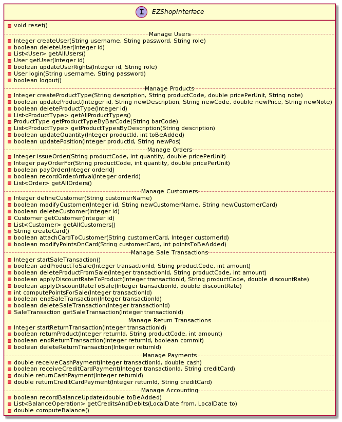
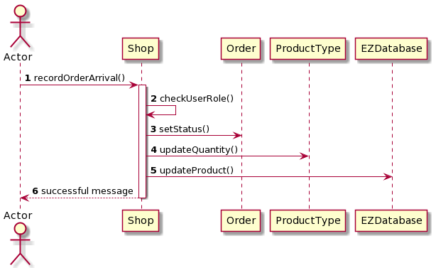
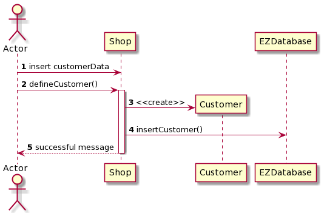
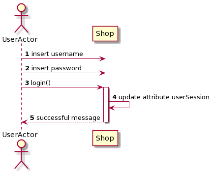
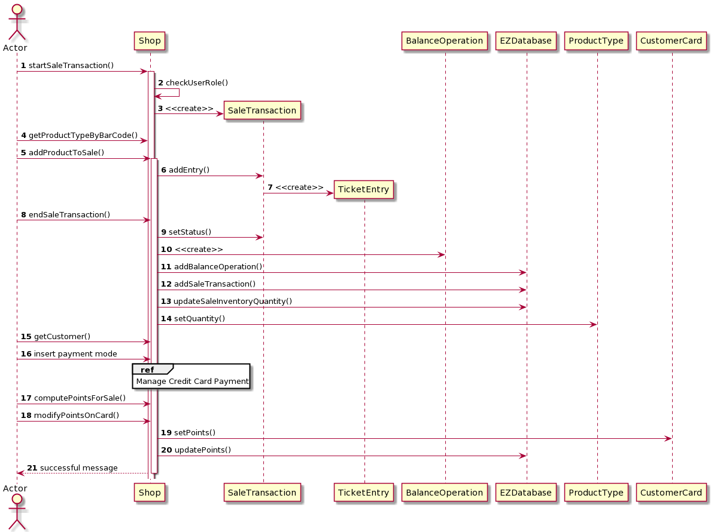
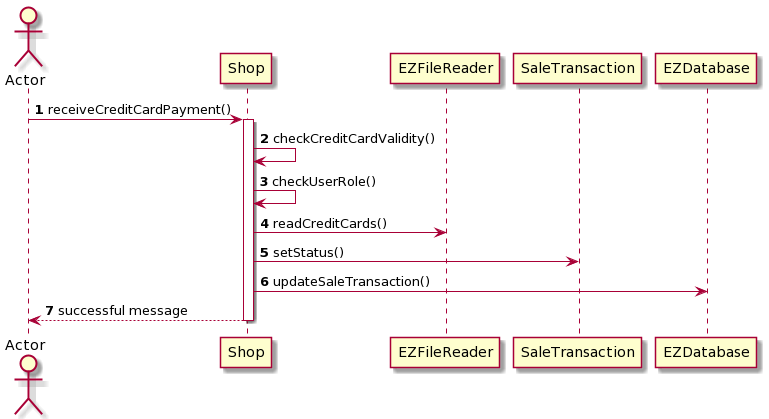
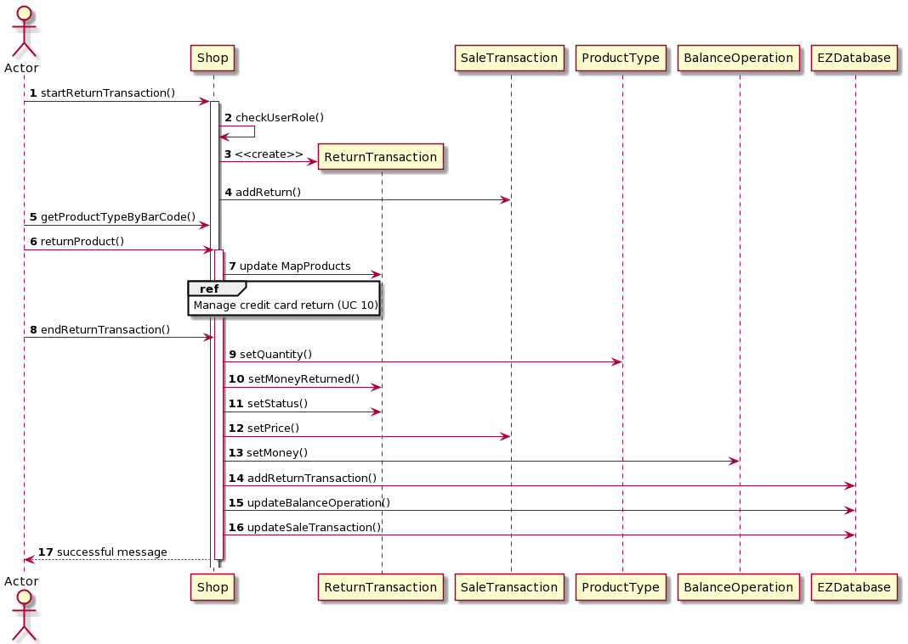
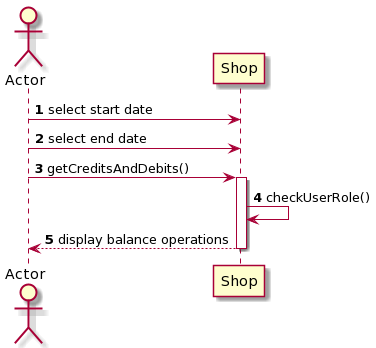

# Design Document 

Authors: Giulia D'Ascenzi, Francesco Di Franco, Mahmoud Hassan Ali, Antonino Monti

Date: 30/04/2021

Version: 1.0

# Contents

- [High level design](#package-diagram)
- [Low level design](#class-diagram)
- [Verification traceability matrix](#verification-traceability-matrix)
- [Verification sequence diagrams](#verification-sequence-diagrams)

# Instructions

The design must satisfy the Official Requirements document, notably functional and non functional requirements

# High level design 

Since the project is very simple and small, the application is composed of only four packages. The application follows the MVC pattern: the View is implemented in the GUI package, while the Model and Control are implemented in the Data, the Model and the Exceptions package.

# Low level design

The Data package contains only the provided EZShopInterface file:

This interface is implemented by the Shop class in the Model package, the structure of which is reported below:

All classes except for UserSession are persistent.

# Verification traceability matrix

| Class \ FR        | FR1  | FR3  | FR4  | FR5  | FR6  | FR7  | FR8  |
| ----------------- | :--: | :--: | :--: | :--: | :--: | :--: | :--: |
| Shop              |  X   |  X   |  X   |  X   |  X   |  X   |  X   |
| User              |  X   |      |      |      |      |      |      |
| BalanceOperation  |      |      |  X   |      |  X   |      |  X   |
| ReturnTransaction |      |      |      |      |  X   |      |  X   |
| Order             |      |      |  X   |      |      |      |  X   |
| SaleTransaction   |      |      |      |      |  X   |      |  X   |
| ProductType       |      |  X   |  X   |      |      |      |      |
| Position          |      |  X   |  X   |      |      |      |      |
| TicketEntry       |      |      |      |      |  X   |      |  X   |
| Customer          |      |      |      |  X   |      |      |      |
| EZFileReader      |      |      |      |      |      |      |      |
| EZDatabase        |      |      |      |      |      |      |      |
| EZCustomerCard    |      |      |      |  X   |      |      |      |

# Verification sequence diagrams

#### Scenario 1.1: Create product type X

#### Scenario 2.1: Create user and define rights

#### Scenario 3.3: Record order of product type X arrival

#### Scenario 4.1: Create customer record

#### Scenario 5.1: Login

#### Scenario 5.2: Logout

#### Scenario 6.4: Sale of product type X with loyalty card update

#### Scenario 7.1: Manage payment by valid credit card

#### Scenario 8.1: Return transaction of product type X completed, credit card

#### Scenario 9.1: List credits and debits

#### Scenario 10.1: Return payment by credit card

