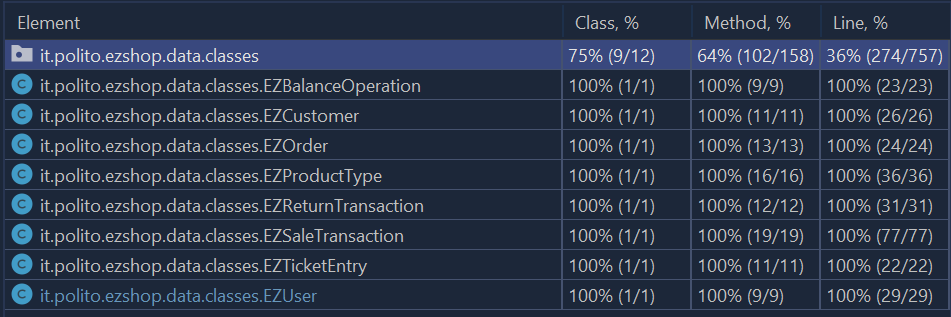

# Unit Testing Documentation

Authors: Giulia D'Ascenzi, Francesco Di Franco, Antonino Monti

Date:

Version: 1.0

# Contents

- [Black Box Unit Tests](#black-box-unit-tests)

- [White Box Unit Tests](#white-box-unit-tests)

# Black Box Unit Tests

    <Define here criteria, predicates and the combination of predicates for each function of each class.
    Define test cases to cover all equivalence classes and boundary conditions.
    In the table, report the description of the black box test case and (traceability) the correspondence with the JUnit test case writing the 
    class and method name that contains the test case>
    <JUnit test classes must be in src/test/java/it/polito/ezshop   You find here, and you can use,  class TestEzShops.java that is executed  
    to start tests
    >

 ### **Class *EZShop* - method *checkBarCodeValidity***

**Criteria for method *checkBarCodeValidity*:**

 - Length of barCode
 - Data type of barCode digits
 - Validity of barCode following a validation protocol

**Predicates for method *checkBarCodeValidity*:**

| Criteria | Predicate |
| -------- | --------- |
| Length of barCode | <13 |
|  | >15 |
| Data type of barCode digits | All digits are numeric |
|  | Not all digits are numeric |
| Validity of barCode following a validation protocol | Valid |
|  | Invalid |

**Boundaries**:

| Criteria | Boundary values |
| -------- | --------------- |
| Length of barCode | 13,14,15 |
| Data type of barCode digits | - |
| Validity of barCode following a validation protocol | - |

**Combination of predicates**:

| Length of barCode | Data type of barCode digits | Validity of barCode | Valid / Invalid | Description of the test case | JUnit test case |
|-------|-------|-------|-------|-------|-------|
|[0, 13)|*|*|Invalid|checkBarCodeValidity("42")  -> false checkBarCodeValidity(null)  -> false|BB_UnitTesting.test_InvalidBarCode|
|(15, maxint)| *                           |*|Invalid|checkBarCodeValidity("62910415002187326548")  -> false |BB_UnitTesting.test_InvalidBarCode|
|*| Not all numeric             |*|Invalid|checkBarCodeValidity("1234a234b")  -> false |BB_UnitTesting.test_InvalidBarCode|
|*| *                           |Invalid|Invalid|checkBarCodeValidity("6291041500218")  -> false |BB_UnitTesting.test_InvalidBarCode|
|[13,14,15]|All numeric|Valid|Valid|checkBarCodeValidity("6291041500213")  -> true|BB_UnitTesting.test_ValidBarCode|

 ### **Class *EZShop* - method *checkCreditCardValidity***

**Criteria for method *checkCreditCardValidity*:**

 - Validity of creditCard following Luhn Algorithm
 - Data type of the digits

**Predicates for method *checkCreditCardValidity*:**

| Criteria               | Predicate |
| ---------------------- | --------- |
| Validity of creditCard | valid     |
| ''                     | invalid/NULL   |
| Data type of the digits | All numeric |
|  | Not all numeric |

**Boundaries**:

| Criteria               | Boundary values |
| ---------------------- | --------------- |
| Validity of creditCard | -  |
| Data type of the digits | - |

**Combination of predicates**:

| Data type of the digits | Validity of creditCard | Valid / Invalid | Description of the test case                         | JUnit test case                       |
| ---------------------- | --------------- | ---------------------------------------------------- | ------------------------------------- | ---------------------- |
| Not all numeric | *                | Invalid         | checkCreditCardValidity("cane")  -> false checkCreditCardValidity(null)  -> false | BB_UnitTesting.test_InvalidCreditCard |
| * | Invalid/NULL | Invalid | checkCreditCardValidity("79927398718")  -> false  | BB_UnitTesting.test_InvalidCreditCard |
| All numeric       | Valid                  | Valid           | checkBarCodeValidity("79927398713")  -> true     | BB_UnitTesting.test_ValidCreditCard   |

# White Box Unit Tests

### Test cases definition

    <JUnit test classes must be in src/test/java/it/polito/ezshop>
    <Report here all the created JUnit test cases, and the units/classes under test >
    <For traceability write the class and method name that contains the test case>

| Unit name | JUnit test case |
| -- | -- |
| Method - EZShop.checkBarCodeValidity | WB_UnitTesting.test_barCodeCheck |
| Method - EZShop.checkCreditCardValidity | WB_UnitTesting.test_creditCardCheck |

### Code coverage report

    <Add here the screenshot report of the statement and branch coverage obtained using
    the Eclemma tool. >

### Loop coverage analysis

    <Identify significant loops in the units and reports the test cases
    developed to cover zero, one or multiple iterations >

|Unit name | Loop rows | Number of iterations | JUnit test case |
|---|---|---|---|
|Method - EZShop.checkBarCodeValidity|6|0|WB_UnitTesting.test_barCodeCheck|
|Method - EZShop.checkBarCodeValidity|6|22+|WB_UnitTesting.test_barCodeCheck|
|Method - EZShop.checkCreditCardValidity|7|0|WB_UnitTesting.test_creditCardCheck|
|Method - EZShop.checkCreditCardValidity|7|1+|WB_UnitTesting.test_creditCardCheck|

